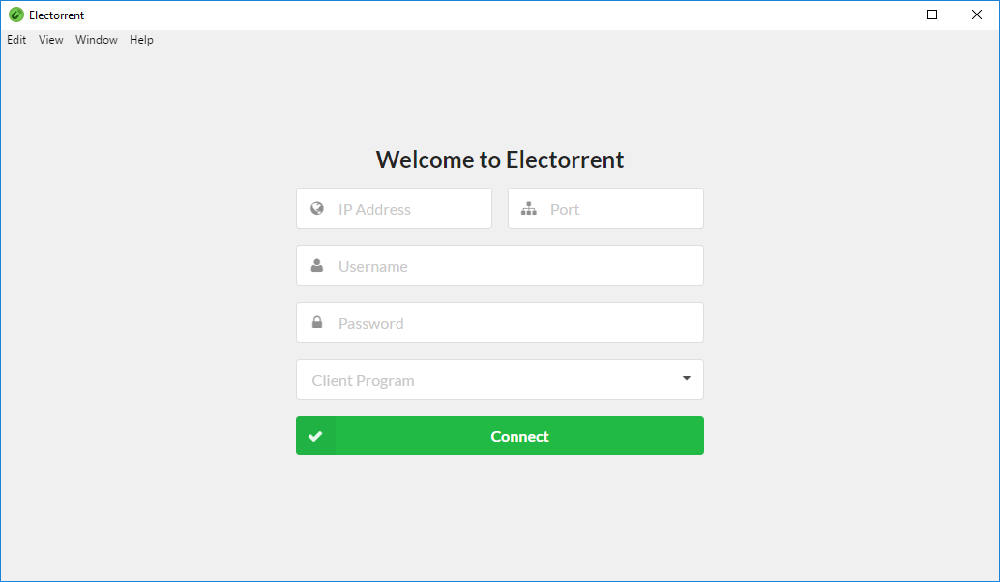
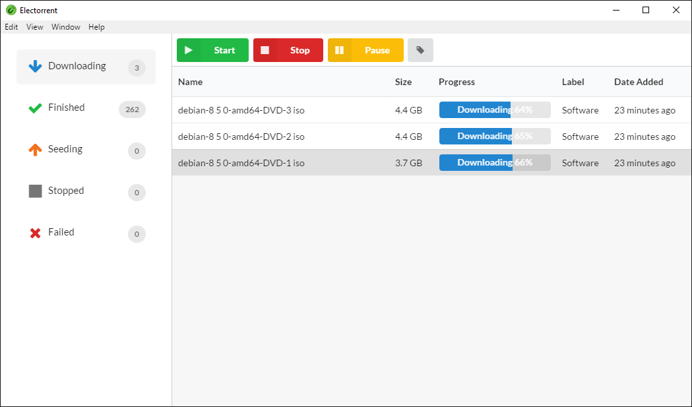
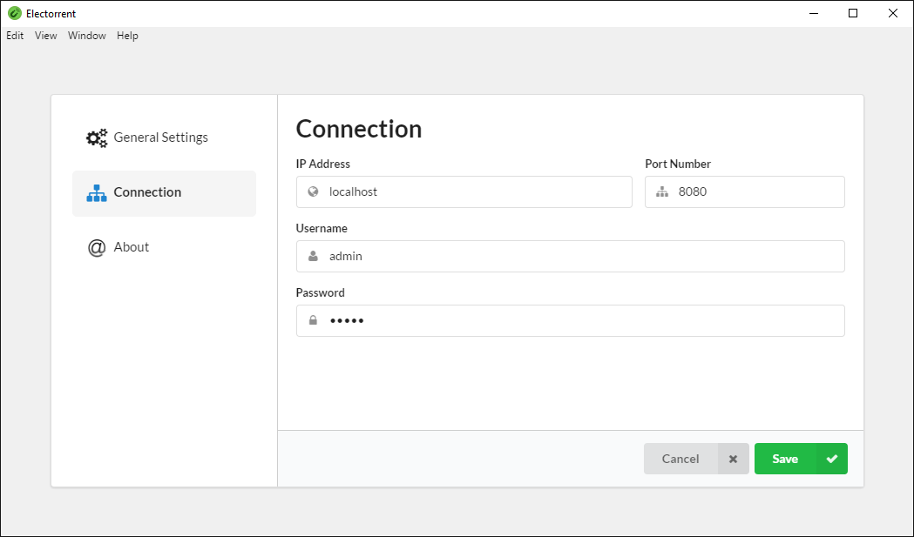

  

  
  
  

# Electorrent
No more! Stop copy/pasting magnet links and uploading torrent files through a tedious webinterface. Electorrent is your new tedious web interface we wrap in an app and take a few hundred MB more RAM!. Remote control your NAS, VPS, seedbox - you name it.

## Support
Electorrent can connect to the following bittorrent clients:
* [µTorrent](http://www.utorrent.com/)
* [qBittorrent](http://www.qbittorrent.org/) (v3.2.x and above)
* [Transmission](https://transmissionbt.com)
* [rTorrent](https://rakshasa.github.io/rtorrent/)
* [Synology Download Station](https://www.synology.com/en-global/knowledgebase/DSM/help/DownloadStation/DownloadStation_desc)
* [Deluge](https://deluge-torrent.org/)

## Downloads
*Please note: I do not own code signing certificates which may results in anti-virus warnings!*
* [Windows](https://electorrent.herokuapp.com/download/win32) (64 bit only)
* [MacOS](https://electorrent.herokuapp.com/download/osx)
* [Linux](https://electorrent.herokuapp.com/download/linux)

## Features
- [x] Connects to your favorite torrent client
- [x] Handles the magnet link protocol when browsing websites
- [x] Upload local torrent files by browsing your filesystem (Ctrl/Cmd+O)
- [x] Drag-and-drop support for torrent files
- [x] Paste magnet links directly from your clipboard (Ctrl/Cmd+I)
- [x] Quickly change between multiple server configurations
- [x] Native desktop notifications
- [x] Fuzzy searching of torrents
- [x] Built in certificate trust system (for self-signed certificates)
- [x] Easy one click installer using Squirrel framework
- [x] Automatic updates straight from the GitHub repository!

## Screenshots

  

  

  

## FAQ
 * **Your program sucks. It doesn't support my bittorrent client**

 What an opportunity! Now open an issue telling me which bittorrent client you would like to see next :)

 * **What kind of technologies are used to build this?**

 The application is build around [Electron](http://electron.atom.io/), [AngularJS](https://angularjs.org/) and [SemanticUI](http://semantic-ui.com/)

* **I can't connect to rTorrent what is wrong?**

 When using rTorrent you have to configure your http server correctly. Follow [this guide](https://github.com/rakshasa/rtorrent/wiki/RPC-Setup-XMLRPC) to make sure you have it set up correctly. Alternative you may be able to use `/plugins/httprpc/action.php` as the path if your have the HTTPRPC plugin installed.
